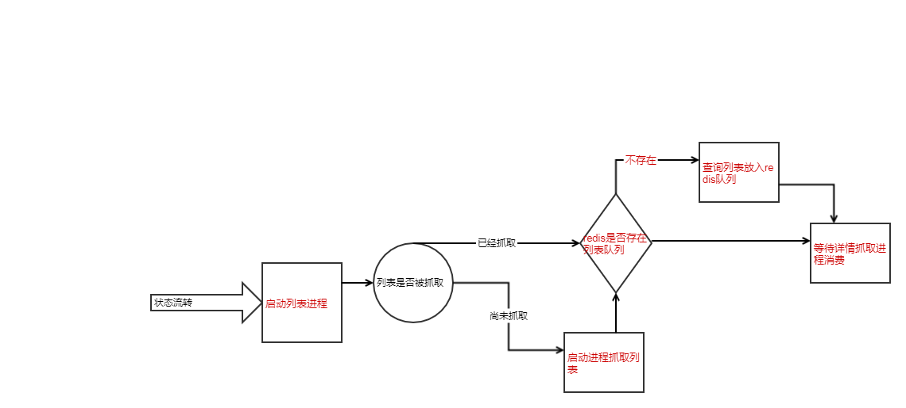

# NovelSpider
* 爬取小说，练练手

## 环境
* `*Unix`环境
* redis 服务

## 类库
* 数据库orm，使用`illuminate/database`
* workerman框架,来自第三方. https://github.com/walkor/Workerman
* DOM解析,来自第三方.http://doc.querylist.cc/
* 前端界面是基于：[iview-admin](https://github.com/iview/iview-admin)，仓库地址是：https://github.com/suhanyujie/NovelSpiderFrontend

## 安装(install)
* 前端界面参考 https://github.com/suhanyujie/NovelSpiderFrontend

## 运行
* 启动提供 web 服务的程序，**必须**到项目根目录运行：`cd /path/to/NovelSpider; php Novel/NovelAdmin/index.php start`
* 启动：`./start.sh start`
* 停止：`./start.sh stop`

## 一些注意事项
* 更新workerman的软件包 `composer update workerman/workerman`
* 截止20181102，目前已经将数据的orm改为 `laravel` 的 `Illuminate database`，详细使用可以参考[官方库](https://github.com/illuminate/database)的文档示例

### composer 镜像源
* 可以先把 composer.lock 文件删除，配置阿里的镜像源 `composer config repo.packagist composer https://mirrors.aliyun.com/composer/`
* 然后 `composer install`

~~### php路由库Macaw~~
~~* 添加路由时，记得放在onWorkerStart的回调中，因为如果针对同一个uri添加n个路由处理时，请求到来时，会被处理n次~~

## 关于爬取小说的一些思路
### web api
* 控制器路径位于 `Novel/Controllers`。例如控制器 `Novel/Controllers/Access/LoginController.php` 的 URI 是 `/Access/Login/login`

### 列表爬虫思路：
* 一个单独的进程，会有定时器，定时循环所有小说看他们是否产生最新连载。 20170422
* 一旦有发现一个，则将其尚未爬取的章节加入到“爬取详情页”的任务队列

#### 小说主表
* 新建一张表,防止每部小说的列表信息,一部小说只有一条 novel_main

##### 处理状态流程图
* 

#### 一些记录
* dom解析使用一个[dom解析服务](https://github.com/suhanyujie/practice/tree/master/htmlParserServer)  20190406
* 实现和前端NovelSpiderFrontend的简单交互                                     20190405
* 去除软件包`indieteq/indieteq-php-my-sql-pdo-database-class`，改用`illuminate/database`  20190303
* 引入league/route路由，对应文档http://route.thephpleague.com/4.x/usage/   20190109
* 添加前端界面展示 20181106
* 更换出具库的查询工具 20181102
* 建立好测试目录,引入phpunit 20170423
* 编写测试代码.已成功在本地运行一个测试代码

## 坑
~~* 对于上方所说的pdo类,在使用过程中,踩了个坑.~~
~~* 在用它进行中文的insert的时候,到了数据库中,乱码了.~~
~~* 乱码的第一反应是,先用其他的方法替代,就不用它的方法.~~
~~* 用其他的方法测试成功之后,我再来找乱码的原因,发现是因为在`Db.class.php`这个而文件中,有一个bind方法,使用了utf8_encode方法,将抓取到的数据,进行了编码导致,这对于英文来讲没什么关系,但对于中文却是致命的..~~
~~* 最后,将bind稍加修改,又能再次使用上方所说的pdo类.~~
